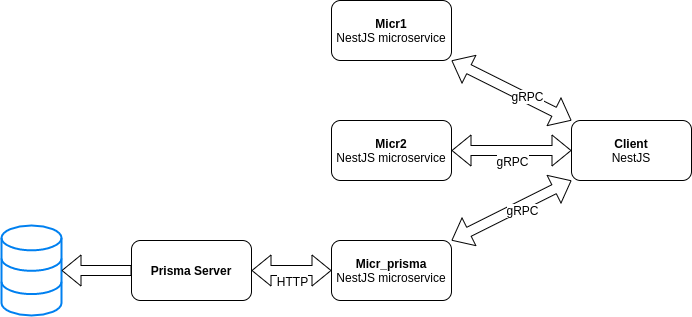

# NestJS + gRPC: a multi microservices example

This repo show as to configure a multi microservices stack in NestJS using gRPC in docker environment.

## Docker Stack

- 3 NestJS microservices
- 1 NestJS client
- 1 Prisma server
- 1 DB MySQL



## Run it!

```bash
make init
docker-compose up
```

Navigate to

```
http://localhost:3000/test/client1
http://localhost:3000/test/client2

http://localhost:3000/test/client_prisma_add
http://localhost:3000/test/client_prisma_get
```

## Protobuf (*.proto) builder
This project use ts-proto library to generate interfaces from *.proto files. 

Just add/edit some proto file into proto folder, then run:
```sh
make proto_build
```

For example, this proto file:
```protobuf
syntax = "proto3";
import "google/protobuf/empty.proto";

package micr_prisma;

service MicrService {
  rpc FindOne (google.protobuf.Empty) returns (UserList) {}
  rpc Save (google.protobuf.Empty) returns (User) {}
}

message User {
  string id = 1;
  string name = 2;
  string surname = 3;
}

message UserList {
  repeated User users = 1;
}
```

generate the following typescript code:
```ts
/* eslint-disable */
import { Empty } from './google/protobuf/empty';


export interface User {
  id: string;
  name: string;
  surname: string;
}

export interface UserList {
  users: User[];
}

export interface MicrService {

  FindOne(request: Empty): Promise<UserList>;

  Save(request: Empty): Promise<User>;

}
```
We can use these interfaces in NestJS project easily.

## Documentation

- <a href="https://mariobuonomo.dev/blog/tutorial-nestjs-microservices-grpc">Blog</a>

## Thanks to

- <a href="https://nestjs.com/">NestJS</a>
- <a href="https://grpc.io/">gRPC</a>
- <a href="https://www.prisma.io/">Prisma.io</a>
- <a href="https://github.com/stephenh/ts-proto">ts-proto</a>
